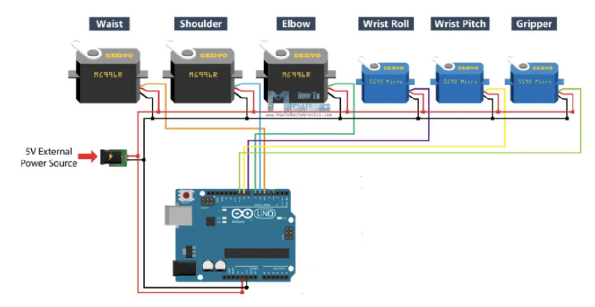
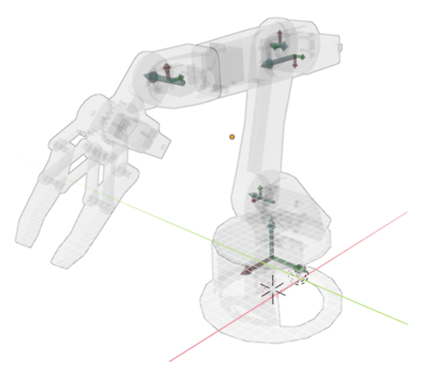
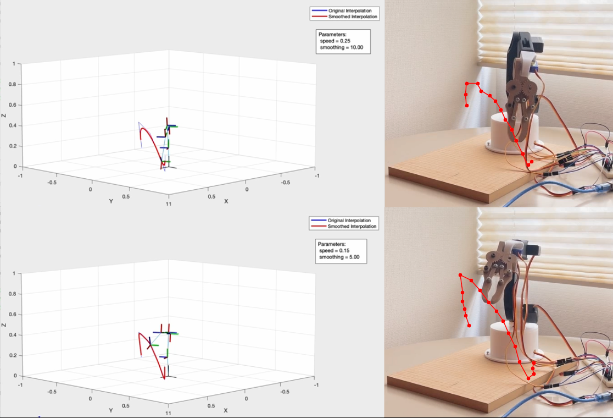
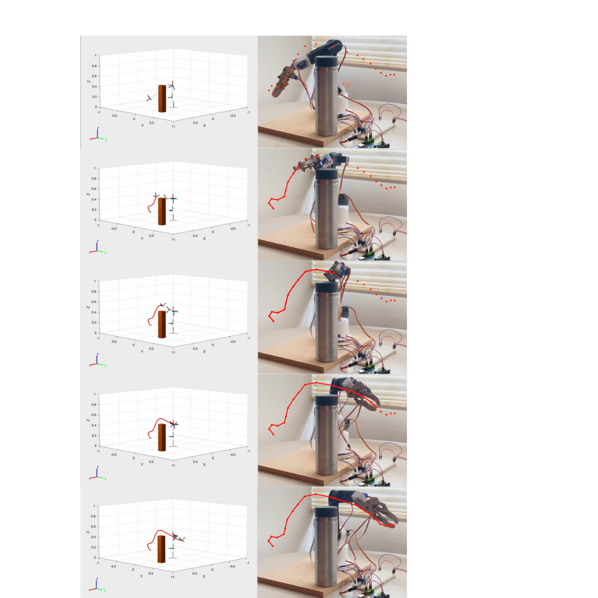

# 6DoF robotic arm
The goal of this project is to create a robotic arm that achieves simple grasping tasks
while being easily accessible to creators with low budgets that want to dive into the
world of robotics and control. By using 3D printed components and cheap servo
motors, a 5DoF robot will be created and then controlled with inverse kinematics using
Arduino and Matlab. To showcase the potential of this architecture, an object-
avoidance control technique and a velocity-based trajectory planning strategy will be
carried out.

## 3D printed robotic structure
The 3D robotic arm utilized in this work is inspired by a popular open-source project
already present on the internet ([GitHub](https://howtomechatronics.com/tutorials/arduino/diy-arduino-
364 robot-arm-with-smartphone-control/)). To move and control the arm, 6 servo motors are
used: three MG996R servos used to control the waist, the shoulder, and elbow of the
robot, and three SG90 which control the wrist roll, the wrist pitch, and the gripper.

## Arduino Wiring

Each servo motor is comprised of three different wires that connect to the Arduino. The
first is the power wire, often labeled as VCC or +5V, the second is the ground (GND)
wire and the third one is the signal wire, which carries control signals between the
Arduino and the servos. These signal wires are connected to Arduino PMW (Pulse-
with-modulation) pins, capable to control the duration of the signal pulse output. Each pulse duration determines a specific servo angle position, allowing for precise control of the shaft movement. Since the Arduino itself is not capable to output the necessary power to drive all the robots at the same moment, an external battery is added to the circuit as an additional power supply.

## Robot Modelling
In this project, the Denavit and Hartenberg (D-H) convention is used. According to this convention, each joint of the robot is associated with a coordinate frame, connected among each other through links, which represent the robot arm components. After determining the frame convention for each joint and the DH parameters, a transformation matrix needs to be constructed. Given a certain joint angle, this matrix allows one to determine the coordinates of a joint position according to the reference frame of the previous joint. The file: dh-convention.blend represents the frame assignment

## Forward and Inverse Kinematics
To control the robot end-effector, a correlation between its position coordinates and the robot joint configuration must be determined. Once the joint angles are calculated, the robot motors will then move to match them. The control model will be based on the Forward Kinematics (FK) and Inverse Kinematics (IK) approaches. The first method allows linking a set of joint angles to a specific end-effector position using the aforementioned transformation matrices, while the second method allows to determine a joint angle configuration from a specific end-effector position. 

## Interpolation of trajectory
In order to verify the potential of this architecture, a control strategy is implemented whose goal is to control the robot's trajectory and speed. The trajectory is the result of interpolation of a set of 𝑛 target points which need to be reached by the robot’s end-effector. Since the robot uses servo motors, the movements to reach these points are quick and snappy due to the discrete nature of servo rotation. In order to reduce this abruptness and to better control the speed of movement, intermediate points are extracted from the trajectory with a user-selected sampling rate 𝑟. The trajectory is also smoothed using a Gaussian filter dependent on a user-selected parameter.

### Result

  

## Object Avoidance
The second control strategy implemented in this research allows the robot to avoid objects positioned inside its working space under the assumption that the position of the obstacle is known. To achieve this, the rapidly exploring random trees (RTT) method is used. This popular motion planning technique is designed to efficiently explore and navigate complex and high-dimensional spaces to find feasible paths for a robot or any other system to reach a desired goal while avoiding obstacles.

### Result

